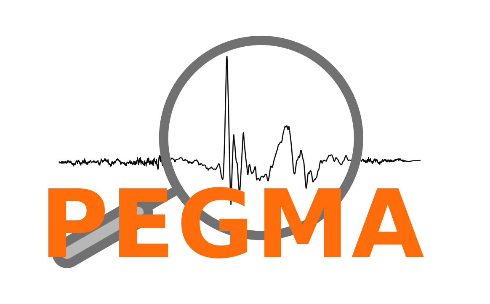

<p align="center">

</p>

# PEGMA: Package for Exploratory Ground Motion Analysis
This is a package for seismologists and earthquake engineers for exploratory analysis of ground motions. It can help in analyzing and selecting the ground motions based on their characteristics.

# Installation and usage
Installation is straight forward using `pip`. The package requires `python version >= 3.6`. To check the version of the python available on your system, open the terminal (Linux/Mac) or command prompt (windows) and enter the following commands to check the version.
```sh
python --version
```
If the above command returns python version number above 3.6, you can replace `python3` from following commands to `python`.  

## Linux/Mac
### Create and activate a virtual environment (Optional but highly recommended)
Open terminal and enter following commands
```sh
python3 -m venv $HOME/trypegma # Give any name of your choice instead of trypegma
source $HOME/trypegma/bin/activate
```
This will create a directory named `trypegma` in your `$HOME` directory and source the new virtual environmant for you to use. Following step must be executed in the same terminal instance without closing it (and not in any other terminal instance).

### Install PEGMA
```python
python3 -m pip install pegma
```

### Use
Once the installation is successful, you can launch `pegma` using command `pegma`. But every time you should first activate the virtual environment (if you followed the first optional step). So you need to use following two commands (if you followed first optional step), or only the second command (if you did **not** follow the first optional step)
```sh
source $HOME/trypegma/bin/activate
pegma
```

## Windows

### Create and activate a virtual environment (Optional but highly recommended)
Open terminal and enter following commands
```sh
python3 -m venv trypegma # Give any name of your choice instead of trypegma
trypegma\Scripts\activate.bat
```
This will create a directory named `trypegma` in your current working directory and source the new virtual environmant for you to use. The following step must be must be executed in the same command prompt instance without closing it (and not in any other command prompt instance).

### Install PEGMA
```python
python3 -m pip install pegma
```

### Use
Once the installation is successful, you can launch `pegma` using command `pegma`. But every time you should first activate the virtual environment (if you followed the first optional step). So you need to use following two commands (if you followed first optional step), or only the second command (if you did **not** follow the first optional step)
```sh
trypegma\Scripts\activate.bat
pegma
```

# Removing PEGMA
In case you need to remove `PEGMA`, simply delete the `trypegma` directory (if you followed the first optional step) or `pip uninstall pegma` (if you did not follow the first optional step).
